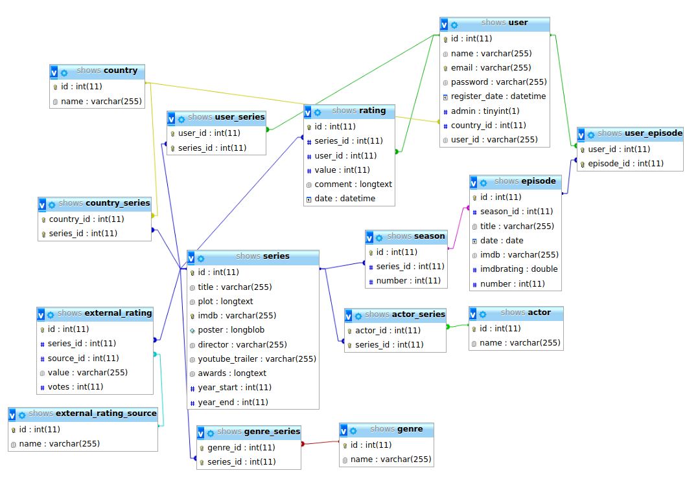

# symfony-streaming-project

1. Clone the project
1. launch the command "composer update" and "composer install" in project folder
1. clone the ".env" file to rename it the cloned file to ".env.local"
1. put your own informations in the ".env.local" to connect to the database.

You can find the database [here](https://gregwar.com/s3web/files/shows.sql.zip) or [here](https://gregwar.com/s3web/files/shows.sql).

# DB schema

